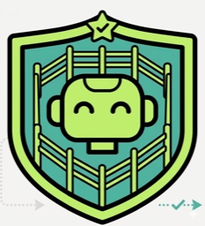

<div align="center">

#  TRIAD

### From Risk Classification to Action Plan Remediation:<br>A Guardrail Feedback-Driven Framework for LLM Agents

[Yuhao Sun](#)<sup>1</sup>&nbsp;·&nbsp;
[Jiacheng Zhang](#)<sup>1</sup>&nbsp;·&nbsp;
[Shaanan Cohney](#)<sup>1</sup>&nbsp;·&nbsp;
[Zhexin Zhang](#)<sup>2</sup>&nbsp;·&nbsp;
[Feng Liu](#)<sup>1</sup>&nbsp;·&nbsp;
[Xingliang Yuan](mailto:xingliang.yuan@unimelb.edu.au)<sup>1,†</sup>

<sup>1</sup>The University of Melbourne&nbsp;&nbsp;·&nbsp;&nbsp;<sup>2</sup>Tsinghua University<br>
<sup>†</sup>Corresponding author

[](docs/paper.pdf)
[](#)
[](https://yuhaosunabc.github.io/TRIAD/)

</div>

<p align="center">
  
</p>

---

## 📖 Overview

LLM-based guardrails usually safeguard agents by emitting **binary allow/deny** signals before execution. But agent
risks often arise when an otherwise **benign task is contaminated** by untrusted content or injected instructions —
and a binary guardrail blocks the whole task, sacrificing the legitimate goal.

**TRIAD** (*Tripartite Response for Iterative Agent Guardrailing*) is a guardrail-integrated agent framework that
turns guardrail outputs from static risk signals into **actionable verbal feedback**. We finetune a language model,
**Tri-Guard**, to produce structured natural-language feedback together with a three-way decision, and inject that
feedback back into the agent's context — forming a **closed loop** between guardrail feedback and agent planning.

## ✨ Key Idea — Three-Way Guardrail Decisions

| Decision | When | What happens |
|:--|:--|:--|
| 🟢 **Proceed** | the plan is safe and on-goal | execute the proposed action |
| 🟠 **Update** | the plan is *partially* unsafe | inject feedback → the agent **revises** its plan, dropping the harmful part while **preserving the benign task** |
| 🔴 **Refuse** | the request is purely harmful | block execution and refuse |

The **Update** decision is what lets TRIAD stop an attack *without* killing the user's legitimate task — the core
difference from allow-or-block guardrails.

## 📊 Results

Across four agent backbones (Qwen3-32B, Kimi-2.5, Gemini-2.5-Pro, GPT-5.1) on **ASB** and **AgentHarm**:

- 🛡️ Average **Attack Success Rate: 74.45% → 10.42%**
- ✅ Average **Task Success Rate: 28.45% → 68.60%**
- ⚖️ Best **Helpfulness–Safety score: 80.92** on AgentHarm

See the [**project page**](https://yuhaosunabc.github.io/TRIAD/) or the [**paper**](docs/paper.pdf) for the full tables and case studies.

## 📁 Repository Structure

```text
TRIAD/
├── evaluation/main_eval/
│   ├── agentharm/run_eval.py     # AgentHarm evaluation entrypoint
│   └── asb/run_eval.py           # ASB (ASB-DPI / ASB-IPI) evaluation entrypoint
├── train/reweighted_sft_trainer.py   # weighted SFT for Tri-Guard (decision-confidence reweighting)
├── train/sft_trainer.py              # plain SFT baseline (uniform weighting)
├── data/train/sft_training_data.json   # curated SFT training set
├── guardrail_prompts.py          # shared guardrail system prompts
├── models/                       # weight placeholders (see models/README.md)
├── docs/                         # project page + paper PDF + figures
└── requirements.txt, accelerate_config.yaml, deepspeed_zero{2,3}.json
```

## ⚙️ Environment Setup

We recommend an isolated **Conda** environment.

```bash
# 1. Clone the repository
git clone https://github.com/YUHAOSUNABC/TRIAD.git
cd TRIAD

# 2. Create and activate a Conda environment
conda create -n triad python=3.12 -y
conda activate triad

# 3. Install dependencies
pip install -r requirements.txt
# Optional runtime deps not pinned in requirements.txt (install as needed):
#   pip install anthropic python-dotenv pyyaml inspect_evals
```

### ⚠️ Compatibility note — Qwen3.5 base guardrail

The base agent/guardrail uses **[Qwen3.5](https://huggingface.co/Qwen/Qwen3.5-9B)**, which is new enough
that stable PyPI releases may not load it yet. `requirements.txt` pins the minimum `transformers` / `vllm`,
but if you hit `model type 'qwen3_5' ... not recognized` (transformers too old) or a `Qwen3_5...Config`
type error (vLLM too old), install both from source / nightly:

```bash
# transformers from source (a.k.a. nightly) — when the model is newer than any release
pip install git+https://github.com/huggingface/transformers.git

# vLLM nightly pre-release wheels
pip install -U vllm --pre --extra-index-url https://wheels.vllm.ai/nightly
```

See the [Qwen3.5-9B model card](https://huggingface.co/Qwen/Qwen3.5-9B) for the exact `vllm serve` command (note `--reasoning-parser qwen3`).

## 🛠️ Quickstart

```bash
# 1. API keys (only needed for closed-source models or LLM-as-judge)
cp .env.example .env   # then edit with your own keys

# 2. Model weights (place in models/ — see models/README.md)
export MODEL_DIR="$PWD/models"

# 3. Run AgentHarm evaluation
cd evaluation/main_eval/agentharm
bash run_eval.sh             # no-defense baseline
bash run_guardrail_eval.sh   # with guardrail

# 4. Run ASB evaluation
cd ../asb
bash run_eval.sh
bash run_guardrail_eval.sh
```

## 🏋️ Reproducing Training

The repo ships **two trainers** — both consume the same SFT data, differing only in how samples are weighted:

- **`train/reweighted_sft_trainer.py`** — the **weighted SFT** used for **Tri-Guard**. Each sample is
  re-weighted by guardrail decision confidence via `--weight_field` / `--weight_min` / `--weight_max` /
  `--refuse_weight`, so the loss emphasizes confident (and de-emphasizes Refuse) samples.
- **`train/sft_trainer.py`** — a **plain SFT** baseline with uniform sample weighting (ablation).

```bash
# Tri-Guard — weighted SFT (DeepSpeed ZeRO-3 comes from accelerate_config.yaml)
accelerate launch --config_file accelerate_config.yaml \
    train/reweighted_sft_trainer.py \
    --model_path "$MODEL_DIR/Qwen3.5-9B" \
    --dataset_path data/train/sft_training_data.json \
    --output_dir "$MODEL_DIR/guardrail_model/Tri-Guard" \
    --num_train_epochs 3 \
    --learning_rate 1e-6 \
    --per_device_train_batch_size 2 \
    --gradient_accumulation_steps 4

# Plain-SFT ablation: swap train/reweighted_sft_trainer.py → train/sft_trainer.py (same flags).
```

> **Note.** DeepSpeed is configured by `accelerate_config.yaml` (`deepspeed_config_file: deepspeed_zero3.json`),
> so do **not** also pass `--deepspeed` to the trainer (double-specifying conflicts). `deepspeed_zero2.json`
> is provided as a lighter-memory ZeRO-2 alternative — point `accelerate_config.yaml` at it to use it.

## 📝 Citation

```bibtex
@article{sun2026triad,
  title   = {From Risk Classification to Action Plan Remediation:
             A Guardrail Feedback-Driven Framework for LLM Agents},
  author  = {Sun, Yuhao and Zhang, Jiacheng and Cohney, Shaanan and
             Zhang, Zhexin and Liu, Feng and Yuan, Xingliang},
  journal = {arXiv preprint},
  year    = {2026}
}
```

## 🙏 Acknowledgements

Our evaluation builds on [AgentSecurityBench (ASB)](https://github.com/agiresearch/ASB) and
[AgentHarm](https://github.com/UKGovernmentBEIS/inspect_evals). We thank the authors of these benchmarks.
